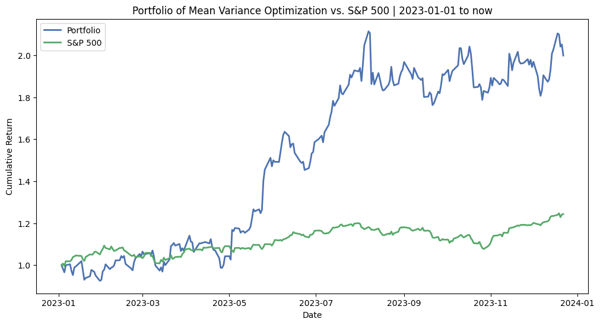

# Simulated Stock Portfolio: Enhancing Investment Success through Fundamental Analysis and Portfolio Optimization

## Abstract:

This report aims to provide a comprehensive analysis of a simulated stock portfolio, highlighting the systematic approach of fundamental analysis, stock selection, and portfolio optimization. By leveraging financial statements, industry trends, and key financial metrics, investors identify stocks with growth potential. The selected stocks are then held for a designated period, to maximize returns.

## Objective:

**The objective of this report is to present a comprehensive analysis of a simulated stock portfolio, focusing on the process of selecting stocks at the end of 2022 or the beginning of 2023.** By adopting a "buy and hold" strategy for one year, we aim to evaluate the performance and returns of the chosen stocks at the end of 2023.

## Note: 
**It is crucial to note that the outcomes and conclusions presented in this report are based on simulated data and do not constitute financial advice.**

## 1. Stock Data Collection 

To ensure the integrity and impartiality of our analysis, **we have deliberately limited our stock selection process to recommendations and information available in the news during 2022**. By constraining our choices to this period, we aim to eliminate any potential bias or future factors that may arise from being aware of 2023 news and trends.

```
stocks_list = ['AMD','NVDA','INTC','ON','ANET','SMCI','GOOG','META','AMZN','BABA','NIO','AMC','NFLX','ADBE','TSLA','UBER','PINS','AAPL',
              'LAD','TNL','MLI','HRI','DVN','MRO','QCOM','MU','AGYS','CECO','TPL','NOV','MRC','ELF','ATI','XOM','CVX','CRM',
              'AMD','GOOGL','DECK','HAL','TMUS','WDAY','LULU','MTDR','AMGN','ADM']
```
> Reference:
> 
> 1. https://www.nasdaq.com/articles/10-top-stocks-to-buy-for-2022
>    
> 2. https://finance.yahoo.com/news/12-best-performing-growth-stocks-185041601.html
>    
> 3. ... ...


## 2. Fundamental Analysis

In our analysis, we collected financial statements and ratios for each selected company, creating a data frame with columns including Symbol, Release Date, Total Revenue, Market Price, Net Income, Total Stockholder Equity, EPS, P/E Ratio, ROE, and ROCE. We focused on key financial metrics such as the P/E ratio, ROE, and ROCE.


### 2.1 Selection Criteria on Fundamental Analysis: 

- **P/E ratio** provides insights into the valuation of a stock, with a higher ratio indicating a higher price relative to earnings. A lower P/E ratio may indicate an attractive investment opportunity, assuming other fundamentals are strong.


- **ROE** measures a company's profitability conversion capability, with a higher ROE indicating better profitability. 


- **ROCE** reflects the company's ability to generate returns for both equity and debt holders. If the ROCE is higher than the ROE, it suggests efficient utilization of debt to reduce the cost of capital.


Filtering stocks based on criteria such as ROE > 20%, P/E < 40%, and a similarity between ROCE and ROE, we aimed to identify stocks with favorable fundamentals for potential inclusion in the portfolio.


### 2.2 Comparison of P/E, ROE, and ROCE for each selected Stock


## Stock Selection

1. ON Semiconductor Corporation (ON):
   - Sector(s): Technology
   - Industry: Semiconductors
   - Description: ON Semiconductor is an American semiconductor supplier, formerly the semiconductor component division of Motorola Group. It has an industry-leading position in the fields of automotive, industrial and cloud power semiconductor components.
    
     
2. Arista Networks, Inc. (ANET):
   - Sector(s): Technology
   - Industry: Computer Hardware
   - Description: Arista Networks was founded to pioneer and deliver software-driven cloud networking solutions for large data center storage and computing environments.

   
3. Super Micro Computer, Inc. (SMCI):
   - Sector(s): Technology
   - Industry: Computer Hardware
   - Description: Supermicro Computer Co., Ltd., mainly engaged in computer host solutions.

     
4. Alphabet Inc. (GOOG):
   - Sector(s): Communication Services
   - Industry: Internet Content & Information
   - Description: Alphabet, Inc is a holding company engaged in the business of acquiring and operating different companies. It operates through its Google and Other Bets divisions. The Google segment includes its major Internet products.

5. Netflix, Inc. (NFLX):
    - Sector(s): Communication Services
    - Industry: Entertainment
    - Description: Netflix is ​​an OTT service company that provides online on-demand streaming of videos around the world.

      
6. Adobe Inc. (ADBE):
    - Sector(s): Technology
    - Industry: Software - Infrastructure
    - Description: Adobe is mainly engaged in the development of multimedia production software. In recent years, it has also begun to develop software such as rich Internet applications, marketing applications, and financial analysis applications.

7. Lithia Motors, Inc. (LAD)
    - Sector(s): Consumer Cyclical
    - Industry: Auto & Truck Dealerships
    - Description: Lithia Motors is an American nationwide automotive dealership group headquartered.

8. Mueller Industries, Inc. (MLI)
    - Sector(s): Industrials
    - Industry: Metal Fabrication
    - Description: Mueller Industries, Inc. is an industrial manufacturer that specializes in copper and copper alloy manufacturing while also producing goods made from aluminum, steel, and plastics. 

9. Devon Energy Corporation (DVN)
    - Sector(s): Energy
    - Industry: Oil & Gas E&P
    - Description: Devon's targets focus on reducing the carbon intensity of our operations, minimizing freshwater use, and engaging constructively with our value chain.

10. Texas Pacific Land Corporation (TPL)
    - Sector(s): Energy
    - Industry: Oil & Gas E&P
    - Description: Texas Pacific Land Trust is one of the largest landowners in the State of Texas with approximately 900000 acres of land in West Texas.

11. Exxon Mobil Corporation (XOM):
    - Sector(s): Energy
    - Industry: Oil & Gas Integrated
    - Description: ExxonMobil is one of the world's largest publicly traded international oil and gas companies.

12. Chevron Corporation (CVX): 
    - Sector(s): Energy
    - Industry: Oil & Gas Integrated
    - Description: Chevron Corporation is one of the world's largest multinational energy companies. Its business scope penetrates all aspects of the oil and natural gas industry: exploration, production, refining, marketing, transportation, petrochemicals, power generation, etc.

13. Deckers Outdoor Corporation (DECK):
    - Sector(s): Consumer Cyclical
    - Industry: Footwear & Accessories
    - Description: Deckers Outdoor Corporation, doing business as Deckers Brands, is a footwear designer and distributor based in Goleta, California, United States. 

14. Matador Resources Company (MTDR):
    - Sector(s): Energy
    - Industry: Oil & Gas E&P
    - Description: Matador is an independent energy company engaged in the exploration, development, production and acquisition of oil and natural gas resources in the US.
   
## 5. Capital Asset Pricing Model

**CAPM**, a widely-used financial model, estimates the expected return on an investment based on its systematic risk, commonly known as beta. In this analysis, we utilized the S&P 500 as a benchmark for our portfolio. The CAPM helped us determine the appropriate required rate of return for our investments.

### 5.1 Normalized Prices for all stocks from 2018 to 2022


### 5.2 Correlation matrix between all stocks


**Correlation coefficient (r)** quantifies the degree to which the prices of two different stocks or financial assets, move in relation to each other. It is represented by the symbol "r" and can take values between -1 and 1.

Interpretation:

*r > 0*: If one stock goes up, the other tends to go up too. +1 means a perfect match.

*r < 0*: If one stock goes up, the other often goes down. -1 means a perfect opposite match.

*r = 0*: They move independently, no clear connection.

### 5.3 Beta  (β)

**Beta  (β)** is a measure of a stock's or portfolio's sensitivity to market movements. It quantifies the systematic risk of an investment.

Interpretation:

β = 1: the stock tends to move in sync with the market.

β > 1: the stock is more volatile (riskier) than the market.

0 < β < 1: the stock is less volatile (less risky) than the market.

β < 0 (negative): the stock moves inversely to the market.

```
{'ADBE': 1.2328564864282514,
 'ANET': 1.1614865409084014,
 'CVX': 1.053841102886013,
 'DECK': 1.1841379444215137,
 'DVN': 1.4677616691104722,
 'GOOG': 1.1075811315395903,
 'LAD': 1.1871205032923944,
 'MLI': 1.2398357309495094,
 'MTDR': 1.8806243183146274,
 'NFLX': 1.0198407575732837,
 'ON': 1.7549356620052805,
 'SMCI': 1.1931803613456669,
 'TPL': 1.1122297095587308,
 'XOM': 0.9118566587605104}
```

### 5.4 Alpha (α) 

**Alpha (α)** is a measure of the difference between actual return and expected return. (Optional)

Interpretation:

If the actual return is higher than the expected return, then α > 0, which means the portfolio performed better than expected, otherwise it is α < 0.

```
{'ADBE': 0.003999720700290811,
 'ANET': 0.05779607411907258,
 'CVX': 0.03927101190495096,
 'DECK': 0.09053534167539967,
 'DVN': 0.12504226036118657,
 'GOOG': 0.014610781667456108,
 'LAD': 0.08208354434535665,
 'MLI': 0.07297194743925607,
 'MTDR': 0.19758635928897855,
 'NFLX': 0.0038582139561013184,
 'ON': 0.10531000976007641,
 'SMCI': 0.15838385276637856,
 'TPL': 0.147034753454329,
 'XOM': 0.045579684242463364}
```

### 5.5 Expected Return Based on CAPM

We constructed a portfolio with uniform weighting.

```
Annual Expected Return Based on CAPM for ADBE is 28.58%
Annual Expected Return Based on CAPM for ANET is 26.93%
Annual Expected Return Based on CAPM for CVX is 24.43%
Annual Expected Return Based on CAPM for DECK is 27.45%
Annual Expected Return Based on CAPM for DVN is 34.03%
Annual Expected Return Based on CAPM for GOOG is 25.68%
Annual Expected Return Based on CAPM for LAD is 27.52%
Annual Expected Return Based on CAPM for MLI is 28.74%
Annual Expected Return Based on CAPM for MTDR is 43.60%
Annual Expected Return Based on CAPM for NFLX is 23.64%
Annual Expected Return Based on CAPM for ON is 40.69%
Annual Expected Return Based on CAPM for SMCI is 27.66%
Annual Expected Return Based on CAPM for TPL is 25.79%
Annual Expected Return Based on CAPM for XOM is 21.14%

Annual Expected Return Based on CAPM for the Portfolio is 16.59% 
```

### 5.6 BackTesting from 2023


We constructed a portfolio with uniform weighting and evaluated its performance. The portfolio's total return was calculated to be 50.01%, indicating the cumulative return achieved throughout the designated holding period.

```
Annual return: 50.01%
Sharpe Ratio: 2.75
Information Ratio: 1.65
```

#### Cumulative Return for all stocks from 2023


## 6. Portfolio Evaluation

To assess risk-adjusted returns, we computed the Sharpe Ratio and Information Ratio for the portfolio. The Sharpe Ratio measures the excess return earned by the portfolio per unit of risk, while the Information Ratio evaluates the portfolio's risk-adjusted performance relative to the benchmark. Our portfolio demonstrated **a Sharpe Ratio of 2.75 and an Information Ratio of 1.65, indicating favorable risk-adjusted returns**.

## 7. Portfolio Optimization

### 7.1 Mean-Variance Optimization

#### 7.1.1 Result of Mean-Variance Optimization

**We employed Mean-Variance Optimization to enhance our portfolio's performance.** Through this process, we achieved a more efficient allocation of assets. The optimized portfolio demonstrated an expected annual return of **46.9%** and annual volatility of **39.2%**. The resulting Sharpe Ratio improved further to **1.14**, indicating **superior risk-adjusted returns**.

```
Expected annual return: 46.9%
Annual volatility: 39.2%
Sharpe Ratio: 1.14
```

#### 7.1.2 Optimized Portfolio's Weighting 


#### 7.1.3 Optimized Portfolio's BackTesting from 2023



#### 7.1.4 Efficient Frontier


### 7.2 Hierarchical Risk Parity (HRP)

#### 7.2.1 Result of Hierarchical Risk Parity (HRP)


**We employed Mean-Variance Optimization to enhance our portfolio's performance.** Through this process, we achieved a more efficient allocation of assets. The optimized portfolio demonstrated an expected annual return of **33.2%** and annual volatility of **30.5%**. The resulting Sharpe Ratio improved further to **1.02**, indicating **superior risk-adjusted returns**.

```
Expected annual return: 33.2%
Annual volatility: 30.5%
Sharpe Ratio: 1.02
```

#### 7.2.2 Optimized Portfolio's Weighting 


#### 7.2.3 Optimized Portfolio's BackTesting from 2023


## Comparison

|               | Annual return |  Sharpe Ratio | Information Ratio |
| ------------- | ------------- | ------------- | ------------- |
| Uniform Portfolio | 50.01%  | 2.75  | 1.65  |
| Mean_Variance Portfolio  | 99.92%  | 1.18  | 0.71  |
| HRP Portfolio  | 62.79%  | 2.59  | 1.55  |

## 9. Conclusion
This report highlighted the importance of a systematic approach to stock portfolio management, encompassing fundamental analysis, portfolio evaluation, and optimization. By considering key financial metrics and industry trends, we identified stocks with growth potential. Through portfolio optimization, we achieved significant enhancements in risk-adjusted returns.

**It is crucial to note that the outcomes and conclusions presented in this report are based on simulated data and do not constitute financial advice**. Investors should consider individual risks, conduct thorough research, and seek professional guidance before making investment decisions. This report serves as an educational tool, enabling readers to gain valuable insights into the complexities of stock market investing and portfolio management.
